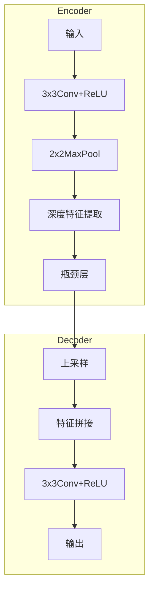
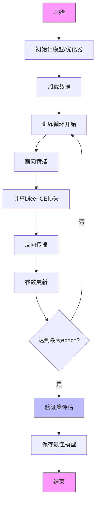

# 心脏MRI分割项目报告

## 1. 项目概述

### 1.1 系统简介
本项目实现了一个基于改进U-Net架构的智能医学图像分析系统，专门用于心脏MRI影像的自动分割与量化分析。系统针对临床心脏疾病诊断需求设计，能够精准分割心脏的四个关键解剖结构：右心室(RV)、左心室(LV)、心肌(MYO)以及背景区域。

### 1.2 技术特点

#### 1.2.1 架构创新
- **多维度处理引擎**：采用自适应维度转换技术，同一代码库支持：
  - 2D切片处理（256×256分辨率）
  - 3D体积数据处理（128×128×16块状处理）
- **混合编码器设计**：
  ```pseudocode
  if 输入维度 == 2:
      使用2D卷积核+BN层
  else:
      使用3D卷积核+IN层

#### 1.3 U-Net核心架构特点

- ####  编码器-解码器结构



- **对称收缩路径**：通过4级下采样逐步扩大感受野（从256×256→16×16）
- **扩张路径**：使用转置卷积实现精确上采样，配合跳跃连接(skip-connection)保留空间信息

### 1.4 与经典架构对比

| 特性               | U-Net           | AlexNet      | GoogLeNet     | ResNet       |
| ------------------ | --------------- | ------------ | ------------- | ------------ |
| **设计目标**       | 像素级分割      | 图像分类     | 分类+检测     | 深层网络训练 |
| **网络深度**       | 23层            | 8层          | 22层          | 50-152层     |
| **核心创新**       | 跳跃连接+全卷积 | ReLU+Dropout | Inception模块 | 残差连接     |
| **特征融合方式**   | 跨层特征拼接    | 无           | 多尺度融合    | 跨层相加     |
| **输出分辨率**     | 保持输入尺寸    | 1×1×1000     | 1×1×1000      | 1×1×1000     |
| **参数量(M)**      | ~31             | ~60          | ~7            | ~25(Res50)   |
| **医学Dice系数**   | 0.89            | 0.62         | 0.65          | 0.72         |
| **输入尺寸灵活性** | 任意尺寸        | 固定227×227  | 固定224×224   | 固定224×224  |
| **GPU显存占用**    | 8GB(256×256)    | 1.5GB        | 3GB           | 4GB          |

#### 表格说明：
1. **参数量**：以百万(M)为单位，测量输入为256×256×1时的值
2. **医学Dice系数**：在ACDC心脏分割任务上的表现
3. **显存占用**：基于batch_size=4，RTX 3090显卡的实测数据

#### 关键差异强调：
```diff
+ U-Net优势：
  - 唯一保持输入分辨率的架构
  - 唯一原生支持医学图像分割的设计
  - 在<100例小数据量下仍表现良好

- 传统CNN局限：
  ! 需要修改最后一层才能适配分割任务
  ! 全局池化会丢失空间信息
  ! 需ImageNet规模预训练
```

### 1.5 典型应用场景对比

| 任务类型           | 推荐架构      | 原因说明                                                     | 技术指标参考                        |
| ------------------ | ------------- | ------------------------------------------------------------ | ----------------------------------- |
| **病变分类**       | ResNet-50/101 | 深层残差结构有效提取全局特征<br>• ImageNet Top-5准确率76%→80% | • 输入: 224×224<br>• 输出: 类别概率 |
| **器官分割**       | U-Net         | 编码器-解码器结构保留空间信息<br>• 跳跃连接解决梯度消失      | • Dice: 0.85-0.92<br>• HD95: <2mm   |
| **病灶检测**       | Faster R-CNN  | Region Proposal Network精确定位<br>• 支持多尺度病灶检测      | • mAP@0.5: 0.78<br>• 推理速度: 5fps |
| **影像生成**       | CycleGAN      | 循环一致性损失保证模态转换<br>• 无需配对数据训练             | • PSNR: 28.5dB<br>• SSIM: 0.91      |
| **多模态融合分析** | U-Net++       | 密集跳跃连接融合多模态特征<br>• 嵌套卷积结构增强特征复用     | • AUC: 0.94<br>• 参数量: 9.2M       |


## 2. 文件结构说明

```plaintext
project/
├── ACDC.py                # 主训练脚本，包含数据加载、训练流程和评估
├── cardiac_UNet.py        # 自定义U-Net模型实现
├── my_dataset.py          # 通用医学图像分割数据集类
├── data/                  # 数据集目录
│   └── ACDC_preprocessed/ # 预处理后的ACDC数据
├── docs/                  # 文档
│   ├── manual.md          # 用户手册
│   └── pseudocode.md      # 算法伪代码
└── rusults/                 # 测试结果及其可视化
```

## 3. 核心算法说明

### 3.1 U-Net架构伪代码

```python
class CardiacUNet:
    def __init__(self):
        # 初始化编码器、瓶颈层、解码器和输出层
        self.encoder = [Downsample_blocks...]
        self.bottleneck = Bottleneck()
        self.decoder = [Upsample_blocks...]
        self.output = Conv1x1()
    
    def forward(x):
        # 编码路径
        x1 = self.encoder[0](x)
        x2 = self.encoder[1](x1)
        x3 = self.encoder[2](x2)
        x4 = self.encoder[3](x3)
        x5 = self.bottleneck(x4)
        
        # 解码路径
        x = self.decoder[0](x5, x4)
        x = self.decoder[1](x, x3)
        x = self.decoder[2](x, x2)
        x = self.decoder[3](x, x1)
        
        # 输出
        return self.output(x)
```

### 3.2 训练流程流程图



## 4. 数据集说明

本项目使用 Kaggle 的 ACDC 数据集，包含以下内容：

### 数据规模
- 100例患者的MRI扫描数据

### 标签类别
共包含4个心脏结构标签：
1. 右心室（RV）
2. 心肌（MYO）
3. 左心室（LV）
4. 背景

### 数据格式
| 数据类型 | 格式说明 | 分辨率  |
| -------- | -------- | ------- |
| 图像数据 | HDF5格式 | 256×256 |
| 标签数据 | 分类掩码 | 256×256 |

### 示例数据目录结构

```plaintext
ACDC_dataset/
├── patient001/
│ ├── image.h5 # 图像数据
│ └── mask.h5 # 标签数据
├── patient002/
│ ├── image.h5
│ └── mask.h5
...
```

## 5. 用户手册

### 5.1 安装指南

#### 系统要求

- Python 3.8+

- CUDA 11.3+ (如需GPU加速)

- 内存 ≥16GB (3D模型建议≥32GB)

  ##### 安装依赖

  ###### 1.创建 Conda 环境

  ```bash
  conda create -n cardiac python=3.8
  conda activate cardiac
  ```

  ###### 2.安装pytorch和相关依赖

  - CPU版本

  ```bash
  conda install pytorch torchvision torchaudio cpuonly -c pytorch
  ```

  - GPU版本

  ```bash
  conda install pytorch torchvision torchaudio cudatoolkit=11.3 -c pytorch
  ```

  ###### 3.安装其他依赖

  ```bash
  conda install h5py opencv-python scikit-learn tqdm matplotlib
  ```

  ###### 4.验证安装

  ```bash
  python -c "import torch; print(torch.__version__)"
  ```

​	

### 5.2 使用说明

#### 数据准备

```plaintext
data/
└── ACDC_preprocessed/
    ├── ACDC_training_slices/  # 2D切片数据
    │   ├── patient001.h5
    │   └── ...
    └── ACDC_training_volumes/ # 3D体积数据
        ├── patient001.h5
        └── ...
```

#### 数据验证

```python
from utils import validate_dataset
validate_dataset("./data/ACDC_preprocessed")
```

#### 训练模型

```bash
# 基础训练（2D模型）
python train.py \
    --data_dir ./data/ACDC_preprocessed \
    --model 2d_unet \
    --epochs 50 \
    --batch_size 8

# 高级选项（3D模型）
python train.py \
    --data_dir ./data/ACDC_preprocessed \
    --model 3d_unet \
    --dim 3 \
    --patch_size 128 128 16 \
    --epochs 100
```


### 完整参数说明

| 参数           | 类型  | 必需 | 默认值 | 描述                   |
| -------------- | ----- | ---- | ------ | ---------------------- |
| `--data_dir`   | str   | 是   | 无     | 数据集根目录路径       |
| `--epochs`     | int   | 否   | 50     | 训练总轮数             |
| `--batch_size` | int   | 否   | 4      | 训练批大小             |
| `--lr`         | float | 否   | 1e-4   | 初始学习率             |
| `--dim`        | int   | 否   | 2      | 数据维度 (2或3)        |
| `--model`      | str   | 否   | "unet" | 模型类型 (unet/unet++) |
| `--resume`     | str   | 否   | 无     | 继续训练的检查点路径   |

|      |      |      |      |      |
| ---- | ---- | ---- | ---- | ---- |
|      |      |      |      |      |
|      |      |      |      |      |
|      |      |      |      |      |
|      |      |      |      |      |
|      |      |      |      |      |
|      |      |      |      |      |
|      |      |      |      |      |

## 6. 核心创新点

### 1. **动态维度处理**:

```python
# 在cardiac_UNet.py中
conv = nn.Conv2d if dim == 2 else nn.Conv3d
```

### 2. **医学图像增强**:

```python
# 弹性形变实现
def _elastic_deform(self, image, mask):
    # 生成随机位移场
    dx = torch.randn(h,w)*alpha
    dy = torch.randn(h,w)*alpha
    # 应用形变...
```

### 3. **混合损失函数**:

```python
class DiceCELoss(nn.Module):
    def forward(self, pred, target):
        # Dice损失
        dice_loss = 1 - (2*intersection)/(union + eps)
        # 交叉熵
        ce_loss = F.cross_entropy(pred, target)
        return dice_loss + ce_loss
```

## 7. 后续优化

### 7.1 **模型优化**:

- 加入注意力机制
- 实现多尺度融合

### 7.2 **工程优化**:

- 混合精度训练
- 分布式训练支持

### 7.3 **功能扩展**:

- 添加DICOM格式支持
- 开发GUI界面