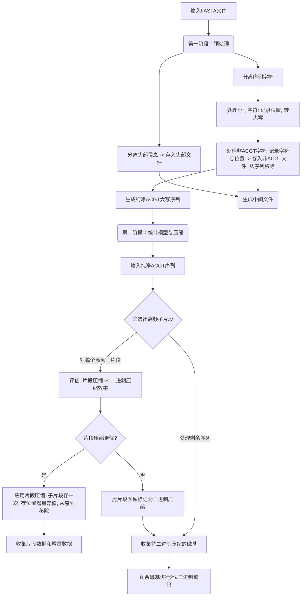

生物计算编程语言

# SeqCompress

## 算法原理

算法的输入是长度为$l$的DNA序列（仅由ATCG四种碱基组成，不含N），从输入序列中统计出现频率（$f$）最高的$m$个长度为$n$的子段$s$。对于每个子段，算法通过如下两组方式评估压缩效率，并选择更优的方案：

### 二进制压缩

DNA序列由四种碱基组成：A、T、C和G。在文本文件中，每个碱基通常用一个ASCII字符表示，占用8位（1字节）。由于只有4种可能性，可以用更少的位数来表示每个碱基，从而实现压缩。

*   $A \rightarrow 00$
*   $T \rightarrow 01$
*   $C \rightarrow 10$
*   $G \rightarrow 11$

**压缩过程：**

1.  **映射：** 将每个DNA碱基字符映射到其对应的2位二进制码。
2.  **打包：** 将这些2位码连接起来。由于计算机通常按字节（8位）处理数据，所以将4个碱基（4 * 2位 = 8位）打包成一个字节。

压缩率$PCR_{b}$可表示为：
$$
PCR_{b}=\frac{二进制压缩后大小}{原始大小} = \frac{f \times n \times 2}{f \times n \times 8} = 25\%
$$
该压缩算法可作为baseline，压缩率固定为$25\%$，用于判断子段是否值得采用高频替换压缩，若$PCR_{s} < 25\%$，则高频替换压缩优于二进制压缩

### 高频替换压缩

**原始大小：**子段出现$f$次，每次占$n \times 8$位，总计$f \times n \times 8$位

**压缩后大小：**存储子段本身需要$n \times 8$位（一次，每个字符$8$位），存储子段每次出现的位置差异（delta）需要$f \times 8$位（假设差异值不超过255），总计$f \times 8 + n \times 8$位

压缩率$PCR_{s}$​可表示为：
$$
PCR_{b}=\frac{二进制压缩后大小}{原始大小} = \frac{f \times 8 + n \times 8}{f \times n \times 8} = \frac{f + n}{fn}
$$
核心思想在于通过记录重复片段的位置，避免重复存储相同内容。

### 比较

若$PCR_{S} < PCR_{b}$，即
$$
\frac{f + n}{fn} < \frac{1}{4} \iff (n-4)f > 4n \iff f > \frac{4n}{n-4}
$$
原文中$n$取8，则当$f > 8$，$PCR_{s} < PCR_{b}$，高频替换压缩更高效。


## 算法流程

1. 数据预处理与初步扫描：算法首先接收 FASTA 格式的输入序列，并将其划分为头部信息和序列信息两部分；头部信息及其在原始序列中的位置被写入单独文件。接着处理序列信息：转换小写字符为大写，同时移除所有非ACGT字符并记录其位置，最终得到一个纯净的、仅包含大写ACGT碱基的序列作为统计模型的输入
2. 筛选高频子段：查找并统计预设长度$n$的所有子片段的出现频率。根据统计结果筛选出那些在序列中重复出现次数最多的子片段，这些高频子片段是后续进行专门压缩优化的候选对象。
3. 压缩效率评估，动态选择压缩策略：对于每个筛选出的高频子片段，算法会进行压缩效率的评估，以决定最佳的压缩方法。它会比较两种策略：一种是基于片段的压缩，即将该高频子片段本身存储一次，并记录其在序列中所有出现位置的增量差值；另一种是直接对构成该子片段的每个碱基进行标准的二进制压缩（例如2位编码）。
4. 编码与输出：所有经过高频替换压缩处理的序列、位置增量数据以及经过2位编码的剩余碱基都将通过二进制压缩进，处理过程中生成的所有中间文件（如头部文件、非ACGT字符文件、子片段位置差异文件、二进制编码文件等）最后都会使用gzip工具进行归档压缩。

### 伪代码

```pseudocode
BEGIN
  cleanACGTSequence, headerInfo, nonACGTInfo = PREPROCESS(inputFile)
  candidateSegments = COUNT_FREQUENT_SEGMENTS(cleanACGTSequence, n_segment_length, m_appear_times)
  remainingSequence = cleanACGTSequence
  
  FOR EACH segment S in candidateSegments:
    calculate PCR_s for segment S 
    calculate PCR_b for segment S  

    IF PCR_s < PCR_b: 
      ADD {segment: S, positions: FIND_OCCURRENCES(S, remainingSequence)} TO extractedSegmentsData
      remainingSequence = REMOVE_ALL_OCCURRENCES_OF(S, remainingSequence) 
  END 
END
```


### 流程图




## 数据来源

本算法使用的测试数据为大肠杆菌K-12菌株MG1655亚菌株，全基因组的FASTA文件可从 [Escherichia coli str. K-12 substr. MG1655 genome assembly ASM584v2 - NCBI - NLM](https://www.ncbi.nlm.nih.gov/datasets/genome/GCF_000005845.2/) 获取


## 用户手册

### 环境配置

```bash
python=3.8.18
numpy=1.24.3
pandas=2.0.3
```


### 使用

1. 下载SeqCompress包

   ```bash
   git clone git@github.com:victorzhu30/bio2502.git
   ```

   

2. 下载所需要的Python包

   ```bash
   conda create -n seqcompress python=3.8.18 numpy=1.24.3 pandas=2.0.3 -y
   conda activate seqcompress
   ```

   

3. 切换目录，运行代码

   ```bash
   cd SeqCompress
   python3 bio2502/SeqCompress/SeqCompress.py ./data/Ecoli.fasta
   
   "Usage: python3 SeqCompress.py <input_fasta_file> [Optional: n m]"
   "n - Length of segments (default: 8)"
   "m - Maximum number of segments to select (default: 6)"
   ```

   


## 运行结果示例

```bash
$ python3 SeqCompress.py ./data/Ecoli.fasta 
Compressed Data saved to ./output/compressed_sequence.bin
高频子段位置数据已存储到 ./output/segments_location.pkl
成功创建 ./output/results.zip，包含 4 个文件
所有生成的结果文件已使用gzip压缩到./output/results.zip
Total time taken: 0:00:14.844955
```


针对大小约为4.5M的基因组，程序运行时间约为15s。

```bash
-rw-r--r-- 4699745 Ecoli.fasta

-rw-r--r-- 1153414 compressed_sequence.bin
-rw-r--r-- 96 	   header.csv
-rw-r--r-- 1       non_ACGT.csv
-rw-r--r-- 10457   segments_location.pkl
-rw-r--r-- 1153119 results.zip
```


最终压缩率约为24.5%。


## 讨论

### 二进制压缩及解压缩的实现细节

如果DNA序列的长度不是4的倍数，那么最后一个字节将不会被完全填满。需要使用`0`来填充剩余的位并记录填充的位数，将其作为一个单独的字节存放在二进制文件开头。解压缩过程从二进制文件中读取一个字节作为填充的位数，从而确定最后一个字节中哪些位是有效数据，哪些位是填充。

### 算法存在的问题

1. 利用滑动窗口法统计高频子段时，高频字段A和高频子段B之间可能会存在overlap，导致后续高频子段A被删除时，高频字段B受影响。
2. 高频替换压缩的压缩率计算公式假设子段s各个位置的差值能够以8位值存储，即$\leq 255$，但实际过程中存在大量的间距大于该值，使得实际压缩率偏大。